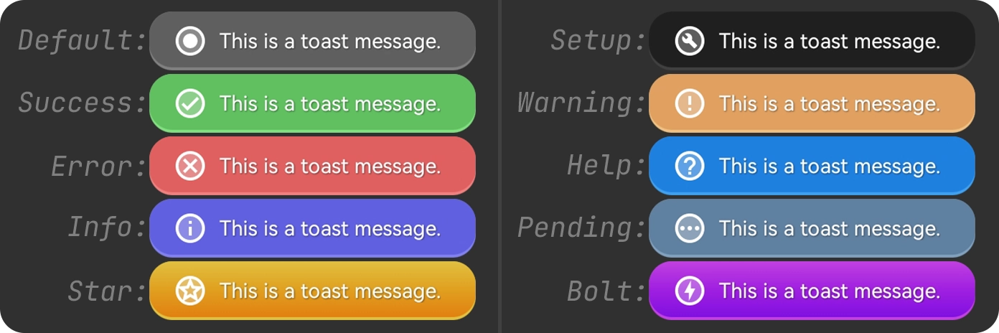

# JimToast 🍞 – A lightweight Android Toast library

JimToast is a lightweight and stylish toast library for Android, written entirely in Java with no external dependencies.
It offers predefined colorful styles, smart queuing, customizable icons, and immediate display support.

# 
[](https://docs.oracle.com/java)
[](https://android.com)
[](https://developer.android.com/about/versions/lollipop)
[](https://jitpack.io/#tmsbj/jimtoast)
[](https://github.com/tmsbj/jimtoast/tree/main/jimtoast/src/main)
[](./LICENSE)

---

## ✨ Features

* 🔹 **Standalone** — No external libraries required
* 🎨 **Predefined types** — 10 colorful styles (Success, Error, Warning, etc.)
* 🔁 **Queue support** — Toasts auto-queued without overlap
* ⚡ **Urgent display** — Cancel queued toasts and show immediately
* 🖼️ **Custom icons** — Set custom drawable or remove completely
* 🧩 **Flexible messages** — Accepts any object (auto-converted to string)
* 🧼 **Clean Java-only** — No annotations, no dependencies
* ❌ **Cancelable** — Cancel active or queued toasts on demand

---

## 📎 Sample APK

Download and install the latest release to see JimToast in action:

👉 [Download Latest APK](https://github.com/tmsbj/jimtoast/releases/latest/download/app-release.apk) 📲

<sub>No permissions required. Works in all Android versions API 21+.</sub>

---

## 📁 Gradle Setup

1. **Add JitPack to your `settings.gradle`:**

<sub>Project-level (`settings.gradle`):</sub>
```groovy
dependencyResolutionManagement {
    repositories {
        google()
        mavenCentral()
        maven { url 'https://jitpack.io' }
    }
}
```

2. **Add the dependency to your `build.gradle`:**

<sub>App-level (`build.gradle`):</sub>

```groovy
dependencies {
    implementation 'com.github.tmsbj:jimtoast:1.0.0'
}
```

---

## 🚀 Usage

**📌 Basic usage:** Show a toast with the default icon based on type

```java
JimToast.show(getApplicationContext(), "Message text", JimToast.DURATION_SHORT, JimToast.TYPE_SUCCESS);
```
#
**⚡ Urgent toast:** Cancel all queued toasts and show this one immediately

```java
JimToast.showUrgent(getApplicationContext(), "Urgent toast", JimToast.DURATION_LONG, JimToast.TYPE_WARNING);
```
#
**🎨 Custom icon:** Override the default icon with a resource, or remove the icon by passing `0`

```java
JimToast.show(getApplicationContext(), "Custom icon", JimToast.DURATION_SHORT, JimToast.TYPE_ERROR, R.drawable.ic_launcher);
  JimToast.show(getApplicationContext(), "Remove icon", JimToast.DURATION_SHORT, JimToast.TYPE_HELP, 0);
```
#
**🧠 Flexible message input:** Accepts any type convertible to `String`

```java
JimToast.show(getApplicationContext(), 3.14f, JimToast.DURATION_LONG, JimToast.TYPE_INFO);
  JimToast.show(getApplicationContext(), new Date(), JimToast.DURATION_LONG, JimToast.TYPE_PENDING);
  JimToast.show(getApplicationContext(), R.string.hello_text, JimToast.DURATION_LONG, JimToast.TYPE_SETUP);
```
#
**🔁 Cancel all current and queued toasts**

```java
JimToast.cancelAllToasts();
```
#
**🔍 Check if a toast is currently showing**

```java
boolean isActive = JimToast.isShowing();
```

---

## ⚙️ Parameters

| Name       | Type                                             | Description                                               |
| ---------- |--------------------------------------------------|-----------------------------------------------------------|
| `context`  | `Context`                                        | A valid Context (Activity or Application)                 |
| `message`  | `Object` (String, CharSequence, or `@StringRes`) | Any text or object convertible to string                  |
| `duration` | `DURATION_SHORT` or `DURATION_LONG`              | Toast display duration                                    |
| `type`     | `TYPE_*` constants                               | Visual style of the toast                                 |
| `iconRes`  | *(optional)* `@DrawableRes int`                  | Custom icon resource. Use `0` to remove, or `-1` to hide  |

All parameters are easy to use and designed to provide maximum flexibility with minimal code.

---

## 🎨 Toast Types

These are the available visual styles:

`TYPE_DEFAULT`, `TYPE_SETUP`, `TYPE_SUCCESS`, `TYPE_WARNING`, `TYPE_ERROR`,  
`TYPE_HELP`, `TYPE_INFO`, `TYPE_PENDING`, `TYPE_STAR`, `TYPE_BOLT`

---

## 📄 License

This library is licensed under the [MIT License](https://opensource.org/licenses/MIT).

---

Made with 💙 by [Javad Tahmasbi](https://github.com/tmsbj)
#
